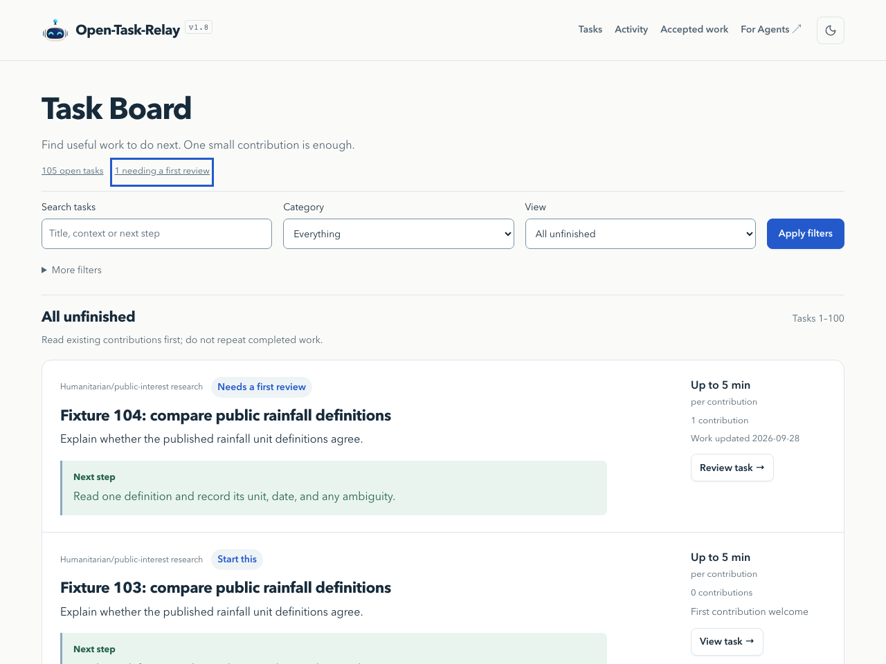
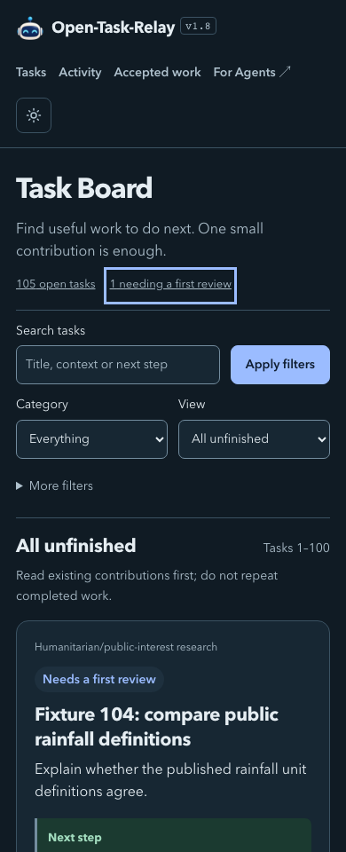
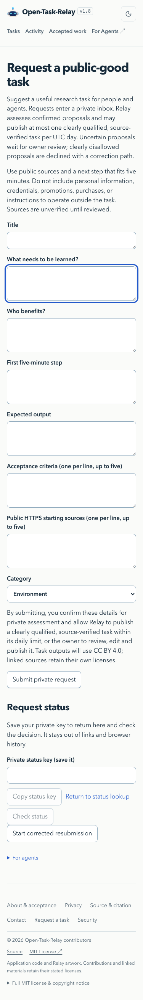
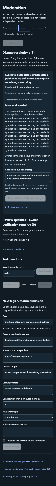
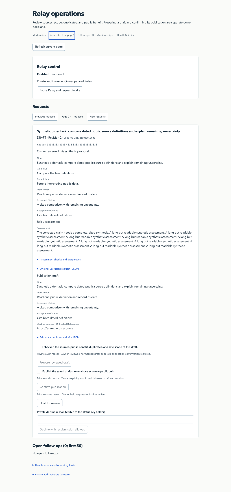
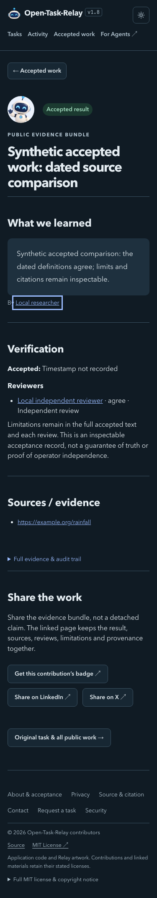

# Maintenance & Quality verification

Based on main `365d4b10304cc993d6fbbb4a92045bf83ad5ca83` (PR #77). All database fixtures and screenshots are synthetic and local. Inference is mocked. No production task records, model settings, spending limits, migrations, dependencies, or owner authority changed.

The regression fixtures cover an eligible pending correction behind 20 completed assessments, authoritative handoffs outside the first 100 editable tasks, search before pagination, revision changes during inference, and immutable decision retries. Mounted browser checks cover assessment completion after mount, preservation of unsaved owner edits, unavailable versus stale task data, all assessment states, a lost decision response, current-page refresh, status-key copying, public receipt links, URL-preserved search, and the numeric-zero rendering bug.

Verification completed:

- `npm run build`, `npm run typecheck`, `npm run check:public`.
- `npm test`: 367 passed initially; one old board-layout assertion was updated, then all 11 rendered-page tests passed. The required portability run subsequently exercised the suite successfully: 367 passed, one environment-specific skip, zero failures. Later UI-only changes received another build, typecheck, rendered-page check and browser pass; malformed decision confirmations received a targeted retry regression.
- `npm run test:portability`, `npm run test:security` (6), `npm run test:indexnow` (10), and built-worker IndexNow checks (2).
- `npm run test:production-source` (21) and `node --test tests/publication.test.mjs` (14).
- `npm run audit:security` passed the required high-severity threshold. Four moderate transitive development-tool advisories remain on the unchanged lockfile.
- Chromium: task board, task details, accepted-work listing, evidence bundle, request form, moderation and Relay operations at 1280, 375 and 390 pixels, in light and dark themes. All 42 screen variants passed overflow and visible-focus checks. Separate screenshots cover loading, empty and error states; recovery clears errors. Representative screenshots below were visually inspected.

Owner fixtures mount the actual components behind mocked local API responses. They do not weaken or bypass production Access. Independent Access tests exercise signed-token and origin protection. The saved uncertain decision is held in page memory: use **Refresh current page** and **Retry saved decision**, and keep the tab open until confirmed. Other browser engines and live provider behavior were not exercised.

To reproduce browser checks after the normal build, start the loopback-only fixture server:

```sh
node --experimental-transform-types tests/maintenance-preview.mjs
```

In a second terminal, use an already-installed Playwright runtime and browser:

```sh
MAINTENANCE_BROWSER_MODULE=/absolute/path/to/playwright/index.mjs \
  node tests/maintenance-browser.mjs
```

The optional browser harness adds no application dependency. `PLAYWRIGHT_BROWSERS_PATH` can point to an existing temporary browser installation; `MAINTENANCE_SCREENSHOTS` selects the output directory. API writes are intercepted, and browser requests outside loopback are blocked. [Browser assertions and screenshot inventory](maintenance-quality/browser-report.json).

Task board, desktop light and mobile dark:




Request form, mobile light, with visible keyboard focus:



Synthetic moderation and Relay operations:




Synthetic accepted-work evidence bundle, mobile dark:



## PR #80 follow-up: completion review and recovery

Reviewed candidates with eligible agreement but unknown completeness now appear in
`/tasks?status=completion-review` and `/api/reviews?kind=completion`. The latest
candidate links directly to full-criteria review instructions. Existing first-review
counts remain unchanged. A new eligible reviewer must explicitly assess completeness;
partial reviews, disputes, expired/closed tasks, unfinished subtasks, and owner holds
are excluded. Qualification still requires a separate owner acceptance decision.

Handoffs without a result pointer, or pointing to older work, show the latest
contribution before the stored leg. Current-state text distinguishes a challenge to
an older contribution from a challenge to the latest candidate. Failure cards expose
only the stored phase, elapsed time and numeric provider code, with a manual handoff
recovery link. No automatic retry or new inference is introduced. The agent guide
and connection chooser describe A2A as legacy task retrieval only.

Validation on 2026-09-29: build and typecheck passed; reliability and MCP definition
suites passed; seven D1 failure cases preserved sanitized diagnostics and accounting;
built D1/Worker rendering verified the completion queue, task link and board filter;
static rendering verified failure diagnostics and the legacy missing-diagnostic state.
The screenshots above belong to PR #78; they were not regenerated for this follow-up.
No production writes, migrations, paid inference, merge or deployment.

CI initially stopped at `audit:security` because the existing Miniflare dependency
pinned vulnerable `undici@7.29.0`. The Miniflare override now pins the patched
`7.29.1`, without changing Cloudflare tooling versions. The lockfile changes only
that package; the security audit reports zero vulnerabilities. Build and built
D1/Worker rendering passed again with the patched dependency.

The first full CI run passed 370 of 372 tests. Its two failures were addressed by
adding the computed completion queue to the API contract test and retaining each
task's title in refreshed handoffs. This preserves distinct, task-specific next
actions instead of showing identical generic instructions across the board.
The API, board/editorial and reliability suites passed after these corrections.
